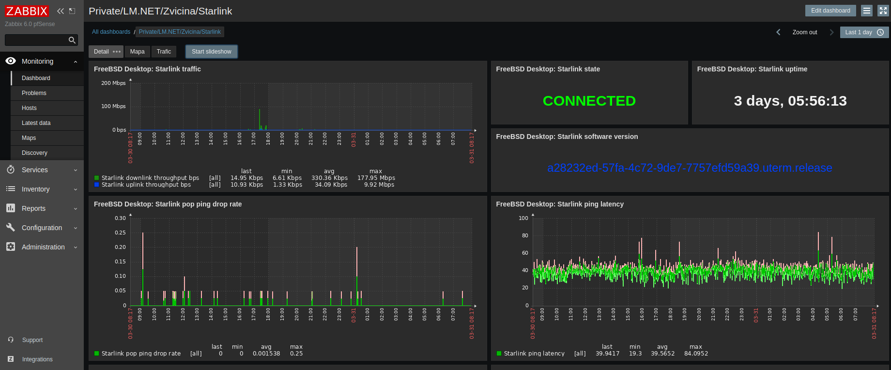
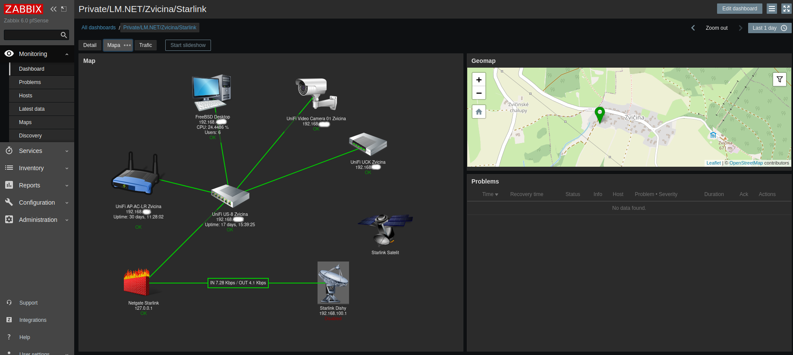
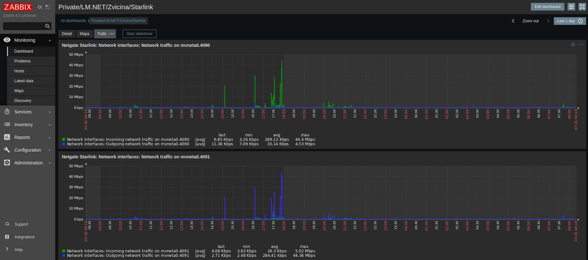

## zabbix-starlink

Monitoring Starlink Dish by [gRPC](https://grpc.io/) and Python project [starlink-grpc-tools](https://github.com/sparky8512/starlink-grpc-tools)

### Tested on FreeBSD

- Package - py39-grpcio-1.52.0		HTTP/2-based RPC framework
- Package - py39-grpcio-tools-1.52.0	Protobuf code generator for gRPC

### How it works

Python projects by gRPC connect to Dish and read information. Result is by
Prometeus format. Zabbix read URL - {$STARLINK.SCHEME}://{HOST.CONN}:{$STARLINK.PORT}/metrics.

### Running on FreeBSD in Screen

```console
function exec_in_screen() {
  name=$1
  command=$2
  screen -dmS $name sh; screen -S $name -X stuff "$command\n";
}

exec_in_screen "starlink" "/usr/local/bin/exporter_starlink.sh"
```

```console
cat /usr/local/bin/exporter_starlink.sh

cd /root/starlink-grpc-tools
/usr/local/bin/python3.9 dish_grpc_prometheus.py status
```

### Running with Docker

```console
git clone https://github.com/sparky8512/starlink-grpc-tools && cd starlink-grpc-tools
cp ../zabbix-starlink/Dockerfile.patch ./
patch < Dockerfile.patch 
patching file Dockerfile-inst

docker build -t starlink-grpc-tools .
docker run -d -t -p 8080:8080 --name='starlink-grpc-tools' starlink-grpc-tools

curl 127.0.0.1:8080
```

### Images





### To do

- Run in Jail or Docker
- Make template for https://github.com/ewilken/starlink-exporter
- Make template for https://github.com/sysdigdan/starlink_exporter
